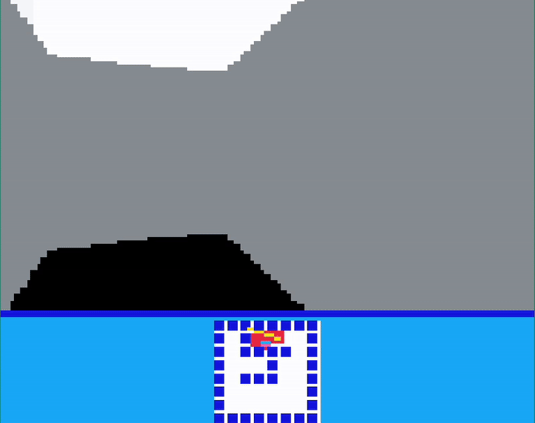

Welcome to SubTile Sprig Renderer's documentation!
=================================================

An arbitrary pixel renderer engine for the game creation platform `Sprig <https://sprig.hackclub.com/>`_ that circumvents the tile-based restrictions of its editor.

Currently, the renderer supports the creation of multiple canvases which can be transformed, as well as the drawing of basic shapes and sprites represented as Base64 encoded RGBA arrays.

.. note::
   This was created as a project for `Shipwrecked <https://shipwrecked.hackclub.com/bay>`_ to gain familiarity with JavaScript and graphical programming. You may find it helpful, but expect inefficiencies and quirks.

.. note::
   Feel free to send me a message on the Hack Club Slack (hatanuk) if you need help or have questions!

Contents:
---------

.. toctree::
   :maxdepth: 2
   :caption: Contents:

   installation
   quickstart
   api/index
   examples

Indices and tables
==================

* :ref:`genindex`
* :ref:`modindex`
* :ref:`search`
