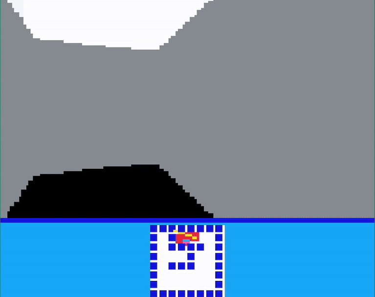

# SubTile Sprig Renderer



An arbitrary pixel renderer engine for the game creation platform [Sprig](https://sprig.hackclub.com/) that circumvents the tile-based restrictions of its editor.

The V2 build features a streamlined API, increased performance and transporability through terser allowing the engine to exist as a single line of code. 

Currently, the renderer supports the creation of multiple surfaces which can be transformed, as well as the drawing of basic shapes and sprites represented as Base64 encoded RGBA arrays.

## Quick Start

1. Copy the minified code from build.js
2. Create a renderer object
   ```js
    let renderer = new SubTileRenderer()
   ```
3. Create a surface object
   ```js
    let gameSurface = new Surface(160, 128) // 160x128 is Sprig's native resolution
   ```
4. Add surface to renderer
 ```js
    renderer.addSurface(gameSurface)
   ```
1. Begin the frame, perform draw operations, and end the frame to display results.
   ```js
    setInterval( () => {
        renderer.beginFrame()
        surface.drawRect(0, 0, 50, 50, "3")
        renderer.endFrame()
    }, 1000)

    // ^^ Renders at 1 fps
   ```

   

> **Note:** This was created as a project for [Shipwrecked](https://shipwrecked.hackclub.com/bay) to gain familiarity with JavaScript and graphical programming. You may find it helpful, but expect inefficiencies and quirks.
> **Double Note:** Feel free to send me a message on the Hack Club Slack (hatanuk) if you need help or have questions!


---
